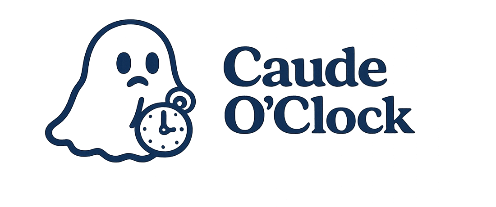
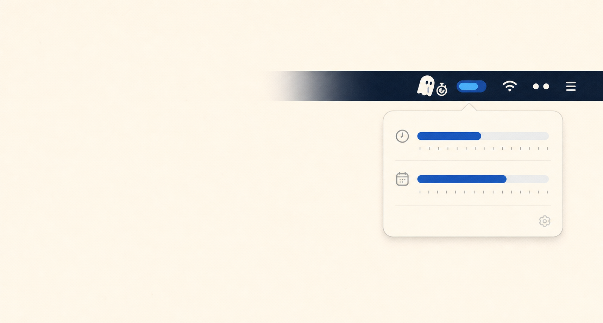

<p align="left">
  
</p>

### Your Claude usage, quietly visible.

Caude o'clock is a tiny macOS menu-bar companion for Claude Code: your 5-hour
and weekly windows, reset times, and today's local activity — without another
dashboard or login.

<p align="left">
  <a href="https://github.com/KarlinskyS/caude-o-clock/releases/latest/download/Caude-o-clock.pkg">
    
  </a>
  <a href="https://github.com/KarlinskyS/caude-o-clock">
    
  </a>
</p>

### Other ways to install

**Homebrew**<br>
```bash
brew install KarlinskyS/caude-oc/caude-oc && caude start
```

---

**From GitHub**<br>
```bash
git clone https://github.com/KarlinskyS/caude-o-clock.git && cd caude-o-clock && ./caude start
```



After installation, run `caude start`. The app appears in the macOS menu bar;
everything else happens from its popover.

<details>
<summary><strong>Why macOS may show a security notice</strong></summary>

The downloadable package is currently unsigned and not notarized because the
project has no Apple Developer ID. If you trust this repository, try opening
the package once, then select **Open Anyway** in **System Settings → Privacy &
Security**. Download packages only from this repository.
</details>

<details>
<summary><strong>For contributors</strong></summary>

Release, package-build, and implementation notes live in
[docs/RELEASING.md](docs/RELEASING.md).
</details>
