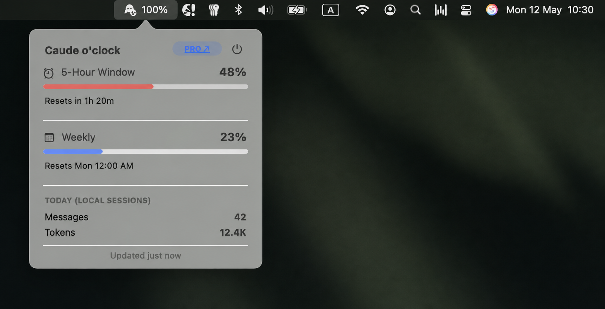

<table>
  <tr>
    <td width="60%" valign="middle">
      <h3>Your Claude usage, quietly visible.</h3>
      <p>Caude o'clock is a tiny macOS menu-bar companion for Claude Code: your 5-hour and weekly windows and reset times — without another dashboard or login.</p>
    </td>
    <td align="right" valign="middle">
      
    </td>
  </tr>
</table>



<p align="left">
  <a href="https://github.com/KarlinskyS/caude-o-clock">
    
  </a>
</p>

<table>
  <tr>
    <td width="60%" valign="middle">
      <h3>Enjoying Caude o'clock?</h3>
      <p>If it helps you stay on top of Claude usage, consider sponsoring its continued development.</p>
    </td>
    <td align="right" valign="middle">
      <a href="https://github.com/sponsors/KarlinskyS">
        
      </a>
    </td>
  </tr>
</table>

### Install

**Homebrew**<br>
```bash
brew install KarlinskyS/caude-o-clock/caude
caude start
```

To stop it later:

```bash
caude stop
```

---

**From GitHub**<br>
```bash
git clone https://github.com/KarlinskyS/caude-o-clock.git
cd caude-o-clock
./caude start
```

To stop it later:

```bash
./caude stop
```

### Use the menu-bar UI

Once started, Caude o'clock appears in the macOS menu bar. Click its icon to
open the popover and view usage or open claude.ai. Use the power icon in the
popover to quit the current app session. Use `caude stop` (or `./caude stop`
from a checkout) when you also want to disable its background launch.

### Found a bug?

Please [open an issue](https://github.com/KarlinskyS/caude-o-clock/issues) on
GitHub — that's the best way to report bugs or request a feature. No GitHub
account? Email 4923920@gmail.com instead.

### License

Released under the [MIT License](LICENSE).

<details>
<summary><strong>If the icon doesn't appear in the menu bar</strong></summary>

Rare, but seen: macOS's menu bar rendering can get into a bad state after
a Mac has been running a long time (weeks of uptime, many menu-bar apps
installed) and silently refuses to register a new icon — with no error
shown anywhere. This isn't specific to Caude o'clock; any menu-bar app can
hit it. If `caude start` reports success but no icon shows up, try these
in order (each is more disruptive than the last, so try them top-down):

1. **Run `caude start` again.** This alone often clears it.
2. **Log out and log back in** — resets macOS's window/menu-bar system
   without a full restart.
3. **Restart your Mac.**

</details>

<details>
<summary><strong>For contributors</strong></summary>

Want to contribute a change? Fork the repo, push your changes to a branch
there, and open a pull request against `main` — no direct write access is
needed. Nothing lands until it's reviewed and merged.

Release notes live in [docs/RELEASING.md](docs/RELEASING.md).

To inspect error states from a cloned checkout without reading Keychain
credentials or calling the API:

```bash
./caude --run-error-429      # API rate-limit error
./caude --run-error-no-auth  # not signed in error
```

Return to normal operation with `./caude stop` followed by `./caude start`.
</details>
