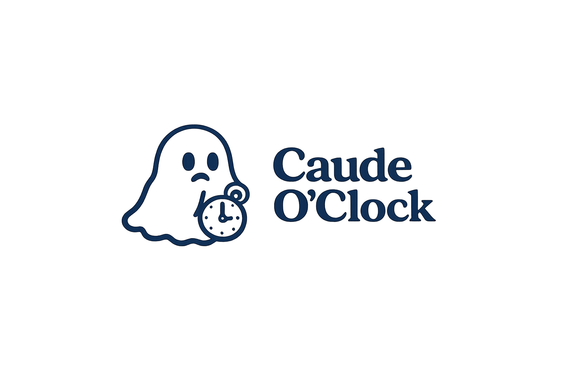

# Caude o'clock

A macOS menu bar app that shows your Claude 5-hour / weekly usage windows,
notifies you at 50/75/90% and when the 5-hour limit resets, and shows
today's local message/token counts pulled from Claude Code's own session
logs. Built from scratch on PyObjC/AppKit (no third-party menu bar toolkit).

It reuses the OAuth token Claude Code's CLI already stores in the macOS
Keychain (after you run `claude login`) — no browser cookies, no separate
login flow.

<p align="center">
  
</p>

## Requirements

- macOS
- Python 3
- Claude Code CLI installed and logged in at least once (`claude login`)

## Install

<p>
  <a href="https://github.com/KarlinskyS/caude-o-clock/releases/latest/download/Caude-o-clock.pkg">
    
  </a>
</p>

### Homebrew

```bash
brew install KarlinskyS/caude-oc/caude-oc
caude start
```

Homebrew requires the final formula name, so the command intentionally has
three segments. The formula (`karlinskys/caude-oc/caude-oc`, from the
[homebrew-caude-oc](https://github.com/KarlinskyS/homebrew-caude-oc) tap)
pulls a tagged source release. It creates its own Python venv under the
Homebrew Cellar and installs `pyobjc-framework-Cocoa` into it. `caude start`
registers the app for your macOS login, starts it, prints its terminal splash
screen, and then returns control to the terminal.

### Download for macOS

Use the **Download for macOS** button above to download the latest `.pkg`.
Open it and follow the installer steps, then open Terminal and run:

```bash
caude start
```

The package contains the app and its Python runtime, so it does not require
Homebrew, Git, or Python knowledge.

#### Why macOS shows a security warning

This package is deliberately **unsigned and not notarized**: the project does
not currently have an Apple Developer ID. macOS may say that it cannot verify
the developer. This does not prevent installation if you have decided to trust
the release: try to open the package once, then go to **System Settings →
Privacy & Security** and choose **Open Anyway**. Download releases only from
this repository and review the source if you are unsure.

When the project obtains an Apple Developer ID, the release package will be
signed and notarized instead.

### Clone from GitHub

```bash
git clone https://github.com/KarlinskyS/caude-o-clock.git
cd caude-o-clock
./caude start
```

The first start creates a local virtual environment and installs the required
Python packages. Later starts use that environment. The `./` is intentional:
it runs the launcher from the cloned folder without changing your global PATH.

## Start and control

After `caude start`, a ghost-with-a-pocket-watch icon and a percentage (`NN%`)
appear in the macOS menu bar. Click it for the usage card; click elsewhere to
dismiss. Use the app's own menu to refresh or quit it — there are intentionally
no command-line `status` or `stop` commands.

`caude start` also arranges for the app to start at your next macOS login.

## Build the unsigned release package

Maintainers can create the GitHub Release asset locally on macOS:

```bash
scripts/build-pkg.sh 0.1.1
```

It creates `release/Caude-o-clock.pkg`. The GitHub Actions workflow performs
the same build and attaches that file whenever a `v*` tag is pushed.

## Notes / caveats

- Uses `https://api.anthropic.com/api/oauth/usage`, which is **not a
  documented or officially supported** endpoint — it's the same one
  claude.ai's own settings page calls internally, and it enforces its own
  (undocumented) rate limit unrelated to your actual Claude usage. The app
  polls gently (every 5 minutes, no fetch on popover open) and backs off on
  `Retry-After` when rate-limited, but the endpoint could change without
  notice.
- Localized into English, Russian, Spanish, German, French, Portuguese,
  Japanese, and Chinese — picked automatically from macOS's own ordered
  language preferences (System Settings → General → Language & Region).
  Override for testing: `CCUSAGE_LANG=ja ./.venv/bin/python ccusagebar.py`.
